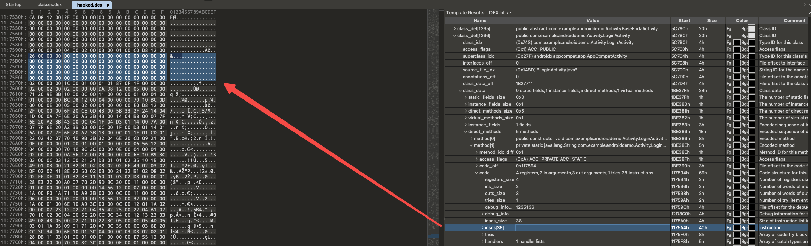
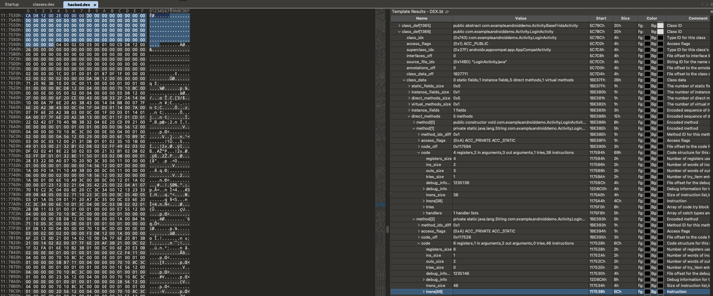
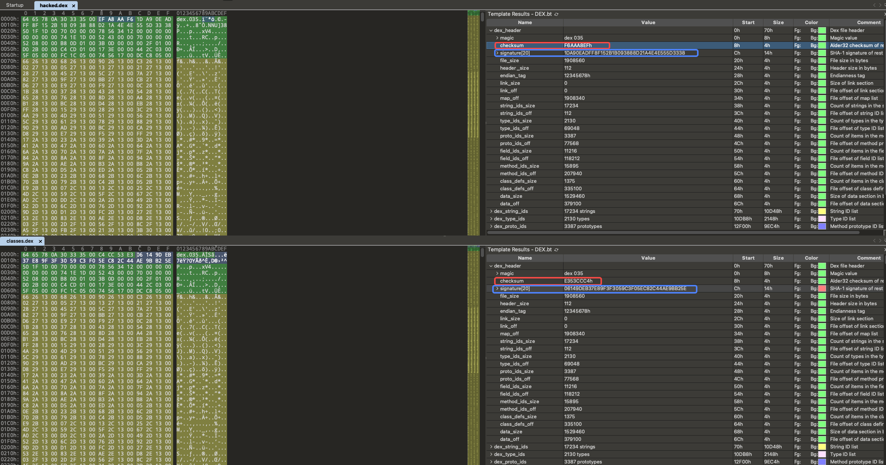
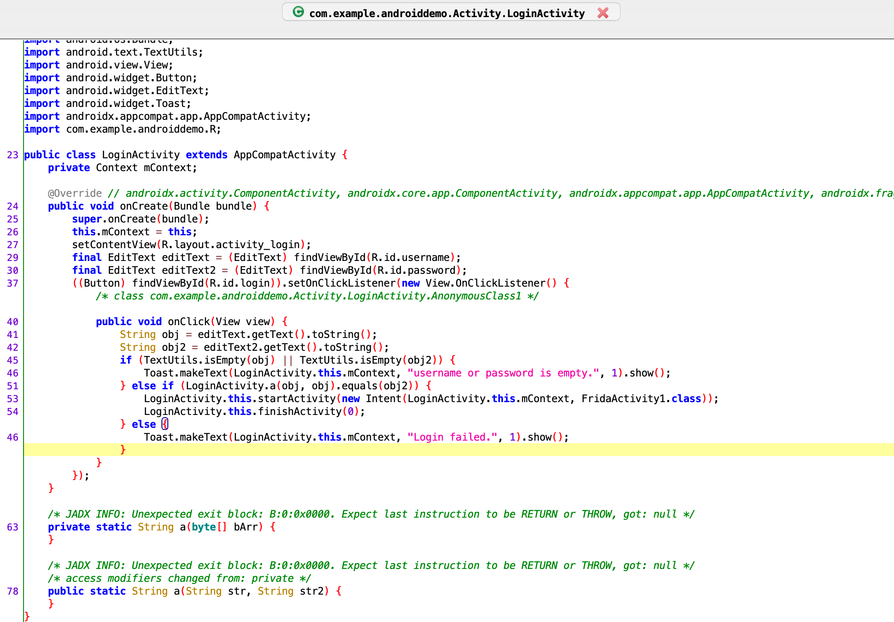

# 二代抽取壳的实现

## 前言

一代壳还是很容易就可以被脱掉的，所以为了加强防护就出现了二代壳，这篇文章主要会介绍下如何再 Dalvik 中实现一个简单的二代抽取壳，但是这篇文章中不会介绍如何脱掉一个抽取壳，这将会在另一篇文章中进行介绍。这里没有介绍 Art 中是如何实现抽取壳的是因为，Art 下实现抽取壳的思路和 Dalvik 相似，只是还原的点不一样，所以就没有进行分析，并且此篇文章中没有对还原部分过多的涉猎，因为懒得配环境了就没有弄还原的部分。

## 二代抽取壳实现原理

一代壳是对 dex 文件整体进行加解密，二代壳的处理粒度变成了函数级别，针对 dex 文件中的类二代壳会将其抽取出来，在运行时再动态的把这个类填充回去。其大致原理就是这样的。

## Dalvik

在 Dalvik 下有很简单的方法来实现一个简单的抽取壳，首先我们解析一下 dex 文件，然后根据解析出来的内容找到要抽取的函数的代码部分，让后将代码部分的内容记录下来然后覆盖原有内容为 0 即可。

这样在反编译器中就已经看不到该函数的代码了，这之后我们需要 hook 一下 dalvik 中的 defineClass 函数，因为在这个函数中会开始解析函数的代码了，在这个函数里将代码填充回去，这样在执行时就不会出现问题了。

还有一点需要注意的是，为了能让代码运行，我们需要在将函数抽取完之后修改 dex 文件的 checksum 和 signature 防止过不去校验导致 dex 文件变成无效文件。

### 抽取代码

首先需要确定要抽取的函数所在的类以及函数的名字，这里需要确定函数所在的类是为了避免两个不同的类中同名的类，确定之后解析 dex 文件。下面是我抽取函数的代码，没有考虑效率等问题主要是为了能让他可以用。

```python
	extract_class_name = "Lcom/example/androiddemo/Activity/LoginActivity;"
	extract_method_name = "a"

	with open("./extract/classes.dex", "rb") as dex:
		parse_header(dex)

		for index in range(0, class_defs_size):
			if extract_class_name == get_class(dex, index):

				dex.seek(class_defs_off)
				class_buf = dex.read(class_defs_size * 0x20)
				class_data_off = int.from_bytes(class_buf[index * 0x20 + 24: index * 0x20 + 28],
												byteorder = "little")
				
				dex.seek(0)
				data = dex.read()

				static_field_size = int(data[class_data_off])
				instance_field_size = int(data[class_data_off + 1])
				direct_methods_size = int(data[class_data_off + 2])

				static_offset = 0
				instance_offset = 0
				direct_offset = 0
				direct_result = []

				for i in range(0, static_field_size * 2):
					offset = 0
					_, offset = uledb128_decode(data[class_data_off + 4:], static_offset)
					static_offset += offset
		
				for i in range(0, instance_field_size * 2):
					offset = 0
					_, offset = uledb128_decode(data[class_data_off + 4 + static_offset:], instance_offset)
					instance_offset += offset

				for i in range(0, direct_methods_size * 3):
					result = 0
					offset = 0
					result, offset = uledb128_decode(data[class_data_off + 4 + static_offset + instance_offset:], direct_offset)
					direct_offset += offset
					direct_result.append(result)

				method_idx_off_buf = []
				for index in range(0, direct_methods_size):
					method_idx_off_buf.append(int(direct_result[index * 3]))

				found_index = []
				for index in range(0, len(method_idx_off_buf)):
					if method_idx_off_buf[index] == 1:
						method_idx_off_buf[index] = method_idx_off_buf[index - 1] + 1 
					if extract_method_name ==  get_method(dex, method_idx_off_buf[index]):
						found_index.append(index)
				
				hacked_buf = []
				dex.seek(0)
				hacked_buf = bytearray(dex.read())
				with open("./extract/hacked.dex", "wb+") as hacked_dex:
					for index in found_index:
						code_off = int(direct_result[index * 3 + 2])
						insns_size = hacked_buf[code_off + 12]
						code = hacked_buf[code_off + 16: code_off + 16 + insns_size * 2]
```

解析之后将代码部分覆盖为 0 并将原有的数据保存起来。下面的图是抽取完之后 dex 文件中该函数的 insns 部分已经全部为 0。





最后计算一下 checksum 和 signature 并且计算出来的新值填充回去，此时抽取就已经完成了。其中 checksum 是使用 Alder32 算法生成的，signature 是使用 Sha-1 算法生成的。下面的代码是还原部分的代码，还原之后这个 dex 文件才可以被执行。

```python
def calc(buf):
	varA = 1 
	varB = 0 
	result = []

	for i in range(0, len(buf)):
		varA = (varA + buf[i]) % 65521
		varB = (varB + varA) % 65521
	
	result.append(varA)
	result.append(varB)

	return result 

def restore_checksum(buf):
	varList = calc(buf[12:])
	checksum = (varList[1] << 16) + varList[0]
	first_byte = checksum & 0xFF
	second_byte = (checksum >> 8) & 0xFF
	third_byte = (checksum >> 16) & 0xFF
	forth_byte = (checksum >> 24) & 0xFF

	buf[8] = first_byte
	buf[9] = second_byte
	buf[10] = third_byte
	buf[11] = forth_byte

def restore_sign(buf):
	import hashlib
	sourceData = buf[12:32]
	sha1 = hashlib.sha1()
	sha1.update(buf[32:])
	sha0 = sha1.hexdigest
	sha2 = sha1.digest()
	for i in range(0, 20):
		buf[12 + i] = sha2[i]

def restore_checksum_signature(buf):
	restore_sign(buf)
	restore_checksum(buf)
```

还原效果如下：



最后我们需要将这个 dex 文件重新打包成 app 以支持在系统中运行。

Tips: 在写抽取部分的时候会遇到在 code_data 中 method_idx_diff 的值全都为 1 的情况，但是这其实是 dex 文件格式为了缩短文件的大小所以如果当前 method_idx_diff 与数组中的只差 1 的话，就将 metho_idx_diff 设置为 1 ，代表与数组中上一个 method_idx_diff 只差 1（`prev_method_idx_diff + 1 = current_method_idx_diff`）

在反编译器中已经看不到对应函数的实现了。



### 小总结

由于此篇文章不是为了制作出一个成熟的加壳工具，所以代码都是以能用为主，主要目的是为了了解一下二代壳的原理以及如何实现。